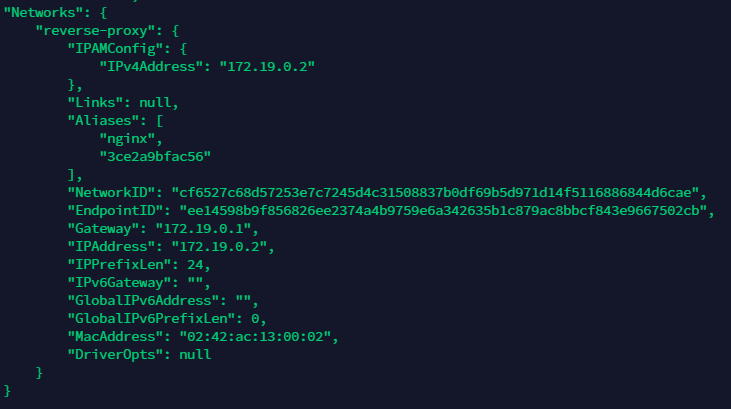

# Unofficial playit.gg agent Docker image

## Table of contents
1. [Building](#building)
2. [Setup](#setup)
3. [Using](#using)

## Building
You can build it locally:
```bash
git clone https://github.com/bartosz11/playit-docker.git
docker build -t bartosz11/playit-docker .
```

## Setup
Note: I don't think there is a point in using this image unless your servers are dockerized. If your servers aren't dockerized, just run agent without Docker. <br/>
Another note: the agent will **not** start the GUI when using this image. <br/>
Example docker run command: 
```bash
docker run -d --name playit -v example-playit-volume:/home/container bartosz11/playit-docker
```
The command might be a bit confusing, so: <br/>
-d means we want the container to run in the background. <br/>
--name playit sets the container name to playit, which allows us to refer to the container in other commands easier. <br/>
-v example-playit-volume:/home/container tells docker to bind volume called "example-playit-volume" to /home/container. This allows us to store config, including tunnels. (if the volume doesn't exist, docker will create it automatically for us) <br/>
bartosz11/playit-docker just tells Docker what image we want to run. <br/>

Or, you might want to use docker compose instead. Below you can see the most basic docker compose file. <br/>
```yaml
version: "3"

services:
  playit:
    container_name: "playit"
    image: bartosz11/playit-docker:latest
    restart: unless-stopped
```
Note: you SHOULD bind some volume to /home/container to prevent config resets. This is shown in the example below.
More advanced compose file would look like this:
```yaml
version: "3"

services:
  playit:
    container_name: "playit"
    image: bartosz11/playit-docker:latest
    restart: unless-stopped
    environment:
      #This allows us to set the timezone (used in logs), Europe/London for example
      #List of TZ timezones: https://en.wikipedia.org/wiki/List_of_tz_database_time_zones
      TZ: "Europe/London"
    volumes:
      #If you want to specify a volume for storing playit.toml (config), remember to bind it to /home/container 
      - example-volume:/home/container  
#Volumes need to be declared here also
volumes:
    #The volume name
    example-volume:
        #If you've already created the volume with "docker volume create", you can set this to true
        external: false      
```

Then, you might want to link the agent to your playit account. I'd just use the 
```bash
docker logs playit
```
command to see the claim URL. You can copy it to any browser, or if your terminal / SSH client allows you to, you can just click it. <br/>

## Using
Note: this example usage assumes, that both server and agent are running on the same machine.
So, after setting up the agent, you might want to set up some tunnels, too. Setting up tunnels itself isn't really hard, but setting the correct local IPs might be. <br/>
First, you should check what networks can your server access: 
```bash
docker inspect <container name>
```
the output will be a big JSON array. We're looking for something like this:
 <br/>
It'll probably look different than this example. Note the IP address after "Gateway" somewhere, we'll use it in a moment. <br/>
Now, you should go to [https://playit.gg/account/tunnels](https://playit.gg/account/tunnels) and create a new tunnel or edit existing one. <br/>
Let's say our example server is Minecraft Java Edition server. So, if you're creating new tunnel, select Minecraft Java, then, page will ask you can you connect to server with 127.0.0.1:25565. Click "No". Then set the local IP to the address you've noted before. Set local port to the port your container exposes. Click "set". Then click "Add tunnel". Assuming both agent and the server are running, you should be able to connect to the server with the tunnel address. <br/>

If you've already created the tunnel, you can click "Edit" on the side. Then edit the local IP to the address you've noted before and set the local port to the port your container exposes. Then just click "save". You should be able to connect to the server using the tunnel address. <br/>

But, what if the value of "Gateway" is just ""? Then you can use 172.17.0.1 as the local IP address on playit.gg. It should always work as it's default Docker's network which all containers should be able to access. <br/>
